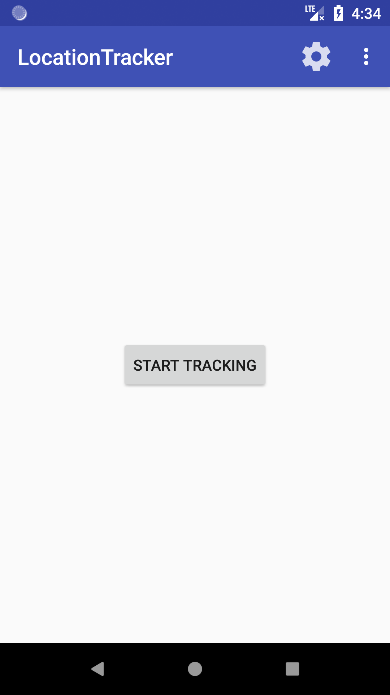
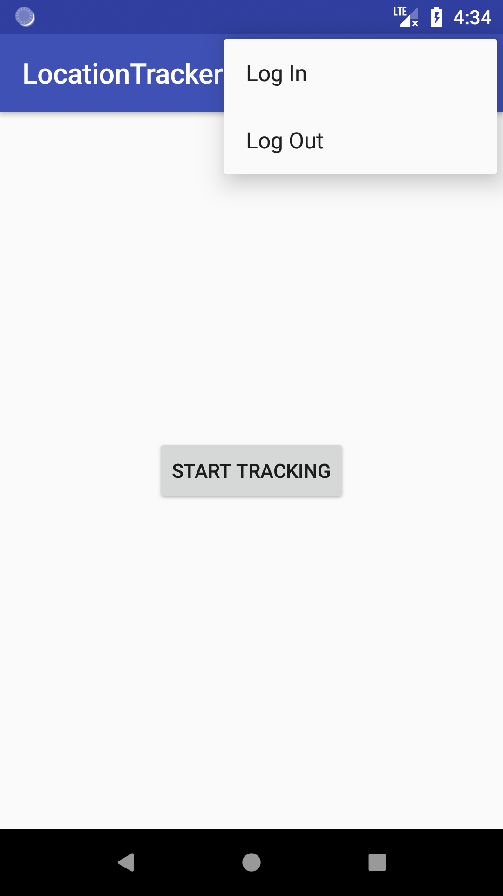
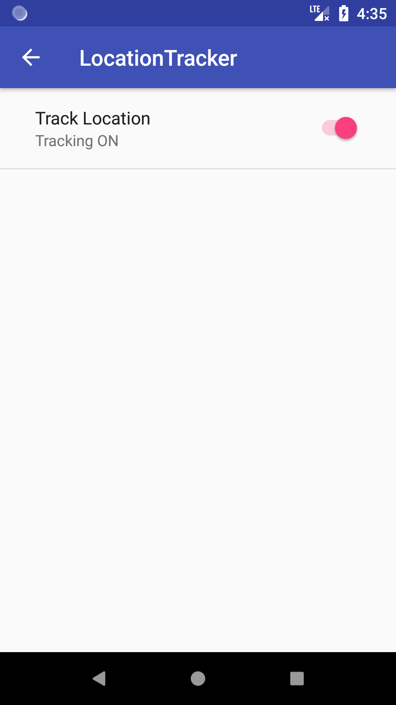
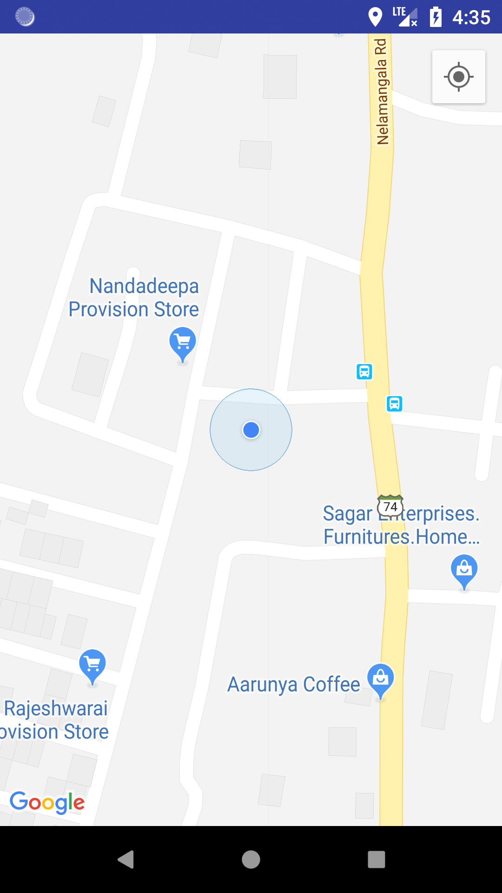
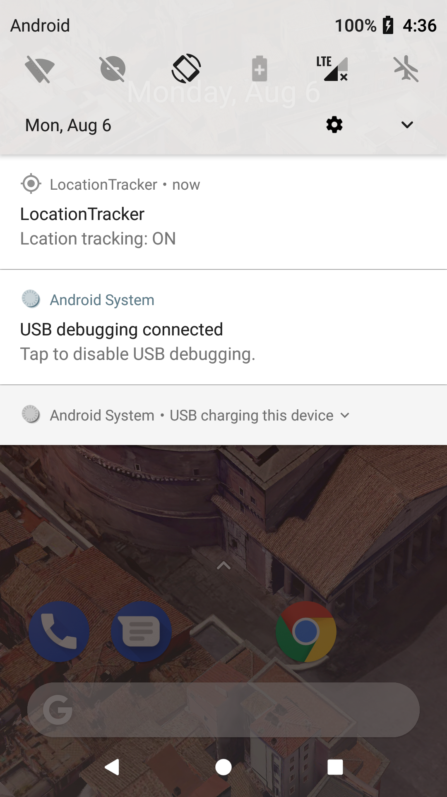

# LocationTracker

  
  
  
  
   

## Included features
<ol>
<li> User login​ and signup​ feature(user-name,mobile,password) and save the details in local database.
Used shared preferences to maintain a login session</li>
<li>Included LogIn, LogOut options</li>
<li>User must be logged in order to launch map.</li>
<li>Provided a Settings option(implemented using SharedPreferences) called Track Location through which user can turn off or turn on the real time location tracking.</li>
<li>If user exist from this MapActivity by pressing home button. App will start the foreground service(by displaying Notification)
    and keep track of the periodic location updates, till user intentionally closes the app.
    App is made to update location in background, only if MapActivity is not destroyed. User can stop the periodic Location updates.
    Either by pressing back button when MapActivity is in foreground or by closing the app in Overview list</li>
<li>When user closes the Map(either by pressing back, or by closing app in Overview list),
    last device location is stored in SQLite database.</li>
<li>On turning off the Settings option called Track location, plotted the location data from db on map</li>
<li>Used MVC architecture</li>
</ol>
